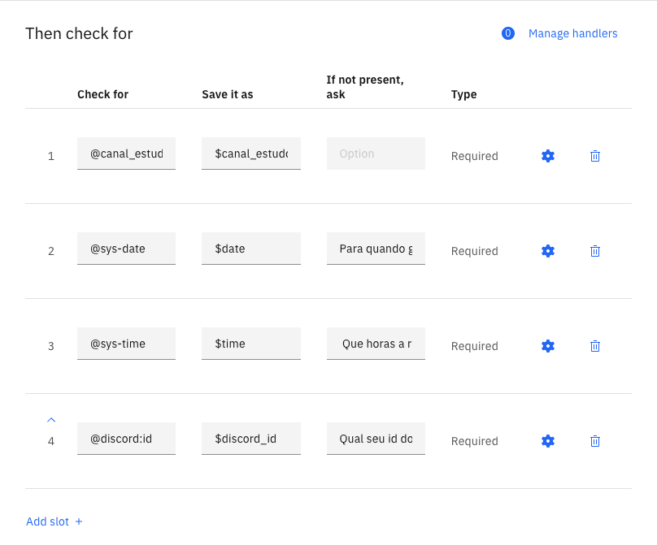

# [02] Watson Assistant - Hands on

### Customização

Dentro de um nó ainda é possível acessar a área de customização para lidar com configurações mais avançadas que possibilitam criar um diálogo ainda mais complexo. Lá pode habilitar as seguintes opções:

**Slot:** Permite que pergunte por várias informações em uma única mensagem e as armazene em variáveis para que possam ser utilizadas em um outro momento. Caso o usuário não diga um dos itens que foi pedido, ele será solicitado novamente, gerando desse modo um loop que só será concluído quando todos os dados forem informados.

Mais informações sobre Slots na documentação: [clique aqui](https://cloud.ibm.com/docs/assistant?topic=assistant-dialog-slots)

**Múltiplas respostas:** Permite dar diferentes respostas para o mesmo input baseado em outras condições. 

**Digressão:** Permite sair do nó onde está, executar outro, e voltar para o nó de origem. Uso comum em nó que possui slot, pois permite responder uma outra pergunta que esteja fora do loop, e depois voltar para concluir aquele fluxo.

Mais informações sobre diálogos complexos na documentação: [clique aqui](https://cloud.ibm.com/docs/assistant?topic=assistant-tutorial&locale=pt-BR)

---

## Escrito por:

.png)

### [Alexia Gabrielly](https://www.linkedin.com/in/alexia-gabrielly/)

IT Service Specialist