# Utilizando Cloud Functions para popular/consultar o Cloudant (NoSQL DB)

Este material foi elaborado buscando exemplificar como realizar a criação de uma nova instância do banco de dados NoSQL Cloudant na IBM Cloud e como fazer a inserção de registros nele através da utilização da IBM Cloud Functions e linguagem de programação Python. Tudo de forma gratuita.

### Passo 1: Acesse a Cloud da IBM

1. [Acesse o site dos recursos da Cloud da IBM](http://cloud.ibm.com/)
2. Faça login na sua conta. Caso não possua, crie uma nova.

### Passo 2: Instancie um serviço de Cloudant e gere credenciais de acesso

1. Na tela de Home, clique no botão "Create resource" no canto superior direito.

    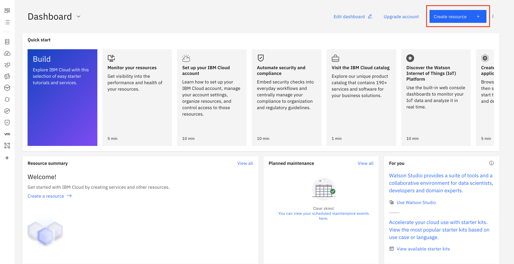

2. Pesquise por "Cloudant" na barra de busca e selecione o primeiro que aparecer.

    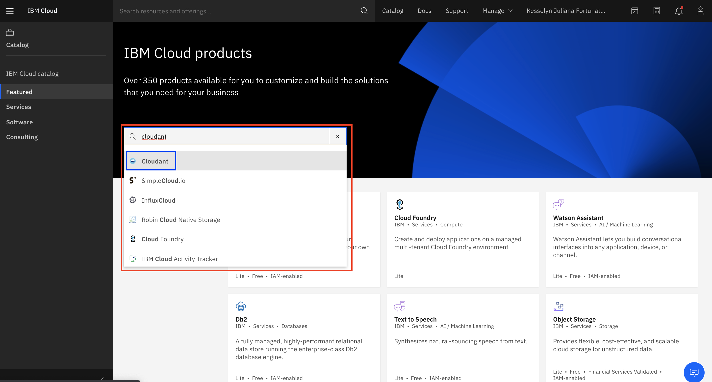

3. Na tela de criação do serviço, no campo de "Select an environment", altere a região para "Washington DC" se necessário.

    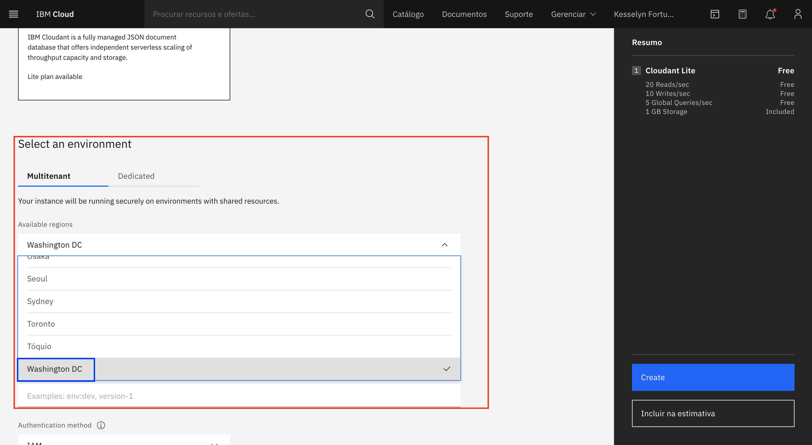

4. Ainda na mesma tela, na parte de "Configure Cloudant instance", no campo de "Authentication method", altere o valor de IAM para "IAM and legacy credentials".

    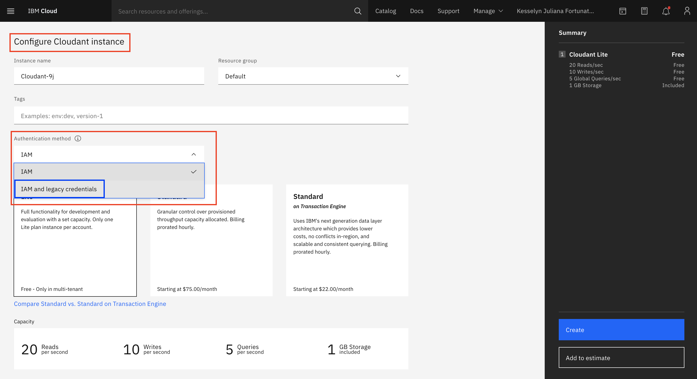

5. Mantenha os demais campos como estão e clique no botão azul de "Create" na canto superior esquerdo. Uma mensagem de confirmação aparecerá na tela quando o processo for concluído.
6. Você será redirecionado para sua lista de recursos, onde o serviço de Cloudant será apresentado. Espere até que o serviço termine de ser provisionado e o status esteja como "Active" para prosseguir. Depois disso, clique no nome do seu serviço, no meu caso "Cloudant-l7".

    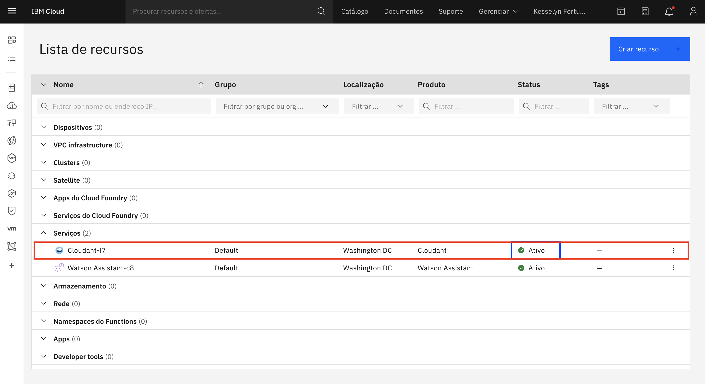

7. Você será redirecionado para a tela inicial do serviço. No canto superior esquerdo, acesse a área de "Service credentials".

    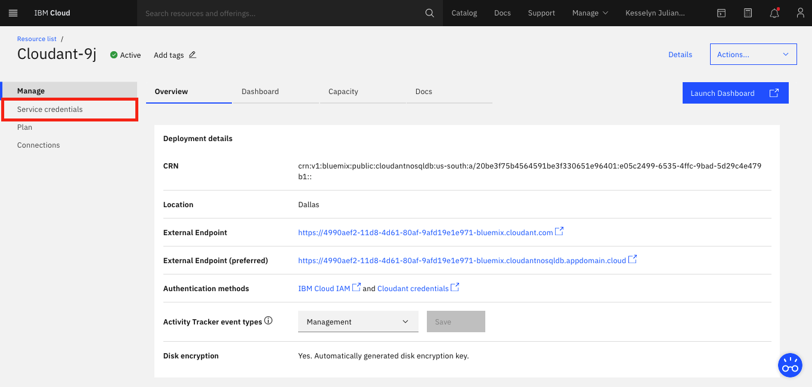

8. Clique no botão azul superior direito "New credential" para gerarmos novas credenciais de acesso ao banco que serão utilizadas posteriormente.

    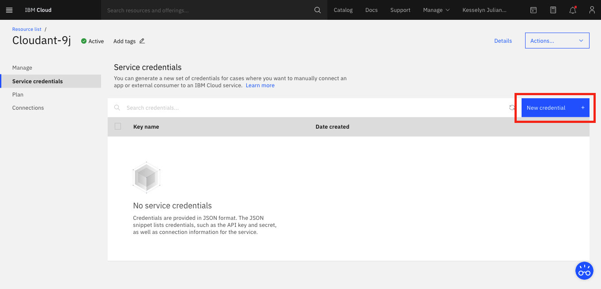

9. Altere o "Role" para "Manager" caso necessário para gerarmos credenciais com todos os acessos disponíveis ao serviço. E clique no botão azul de "Add".

    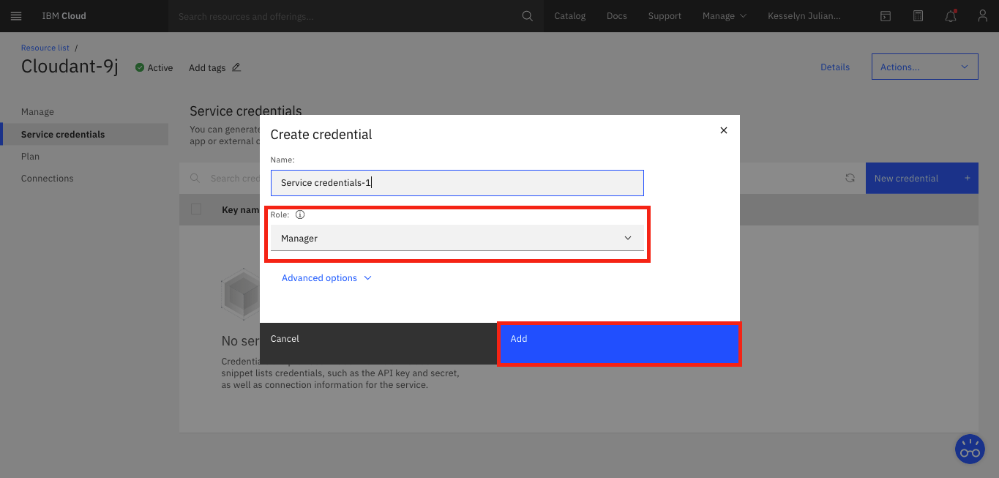

10. Sua credencial de serviço será criada, para acessar seus dados, expanda o campo. 
11. Guarde os campos de "username, password e url" para usarmos nos próximos passos.

    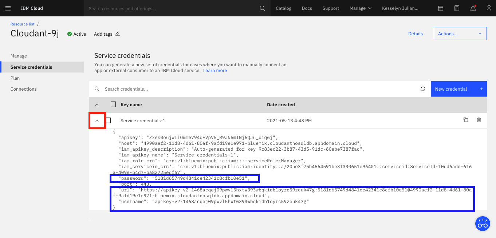

### Passo 3: Criando uma Function em Python para inserir os dados no banco

1. Ainda na tela das credenciais do Cloudant, clique no menu superior esquerdo para acessar a lista de funcionalidades da Cloud.

    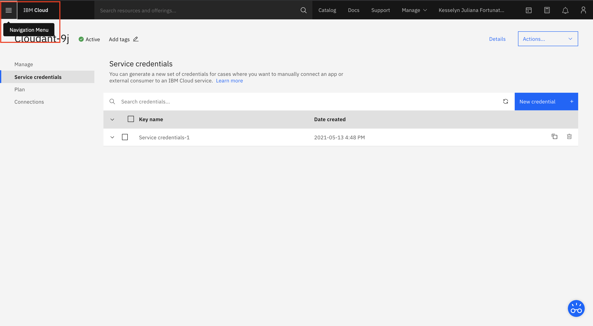

2. Apenas passe o mouse em cima das "Functions" e quando o botão expandir, clique em "Actions", para ser redirecionado para a tela de criação de functions.

    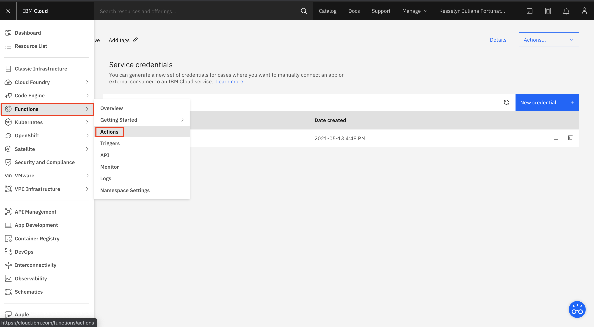

3. A tela abaixo será exibida, clique no botão "Create" azul para criar uma nova function.

    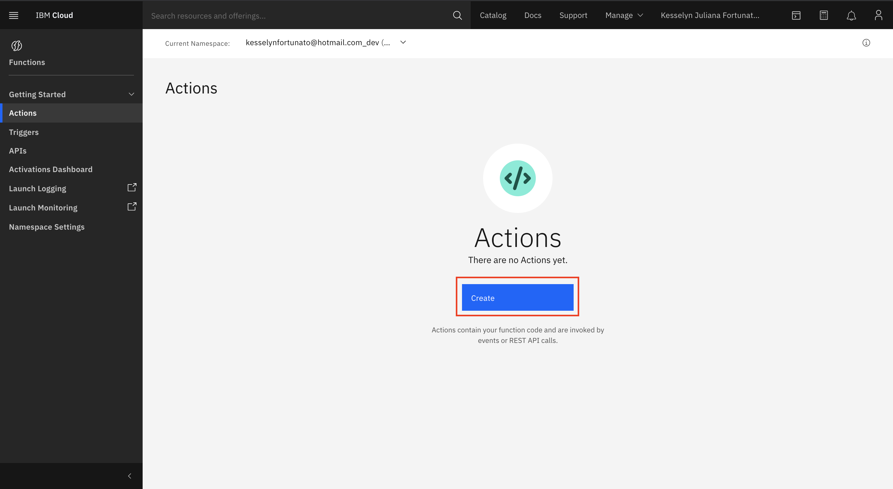

4. Em "Action Name" de um nome para a função que estamos criando, aqui coloquei "insertToCloudant", mas você pode por o nome que desejar.
5. Para manter a organização quando temos muitas functions, podemos criar pacotes onde elas serão inseridas como um grupo. Como estamos criando apenas uma, vamos manter com o pacote (Default).
6. Em "Runtime", clique no botão que expande as opções para alterarmos a linguagem de programação.

    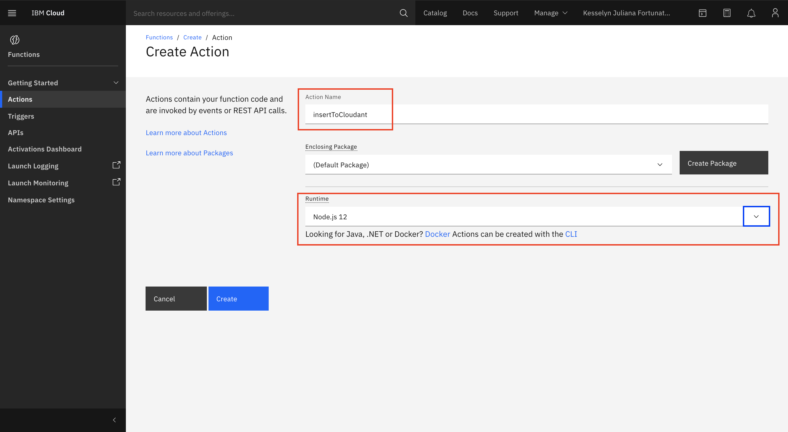

7. Selecione a linguagem "Python 3.7" e clique no botão "Create" azul abaixo para criarmos nossa function.

    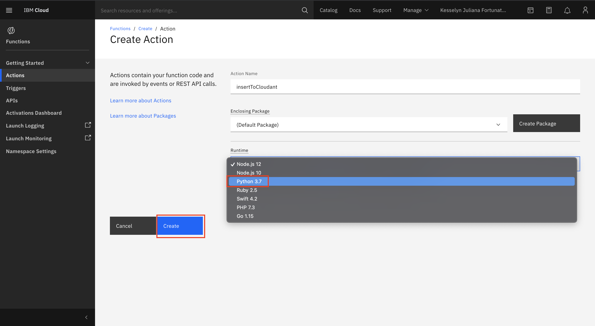

8. Quando a function terminar de ser criada a tela abaixo será exibida. Esse trecho de código já vem por padrão em todas as function, com um método "main" que será chamado toda vez que a function for disparada e o "return" de um objeto.
9. Selecione todo o código da function e o apague.

    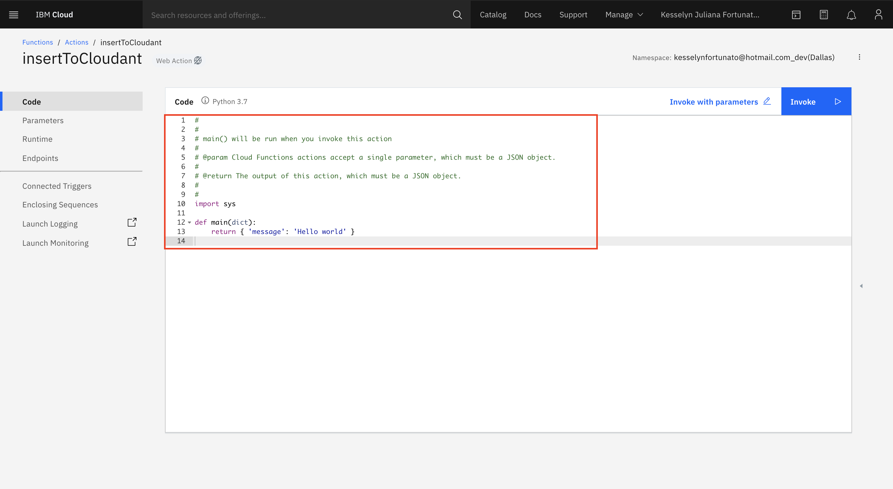

10. No lugar do código que acabamos de apagar, cole o código abaixo. Nesse código iremos estabelecer conexão com nosso serviço Cloudant, criar um banco de dados e inserir alguns registros referentes aos tipos de viagens de uma agência.

```python
#
#
# main() will be run when you invoke this action
#
# @param Cloud Functions actions accept a single parameter, which must be a JSON object.
#
# @return The output of this action, which must be a JSON object.
#
#
import sys
import time
from cloudant.client import Cloudant
from cloudant.error import CloudantException
from cloudant.result import Result, ResultByKey

def main(dict):
    # Adicionando as credenciais do nosso banco Cloudant
    # Preencha com as credenciais do seu banco, mantendo as aspas
    serviceUsername = ""
    servicePassword = ""
    serviceURL = ""
    
    # Utilizando as credenciais para estabelecer conexão com a instância do Cloudant
    client = Cloudant(serviceUsername, servicePassword, url=serviceURL)
    client.connect()
    
    # Informando qual banco vamos criar, caso o banco com esse nome já exista ele utiliza o que já está criado
    myDatabaseDemo = client.create_database("agenda-canal-estudos")
    
    # Criando um objeto para ser inserido no banco com os dados vindos do Watson Assistant
    doc = {
        "date": dict["date"],
        "time": dict["time"],
        "discord_id": dict["discord_id"],
        "canal_estudos": dict["canal_estudos"]
    }
    
    # Inserindo no banco
    newDocument = myDatabaseDemo.create_document(doc)
    
    # Verificando se o registro foi inserido corretamente
    if newDocument.exists():
        print("Document successfully created.")
        

    return {  }
```

1. Note que temos 3 variáveis vazias no nosso código que correspondem as credenciais do Cloudant que geramos anteriormente e que guardamos para usar em outro momento.
2. Cole suas credenciais entre as aspas e clique no botão "Save" azul na parte superior direita.

    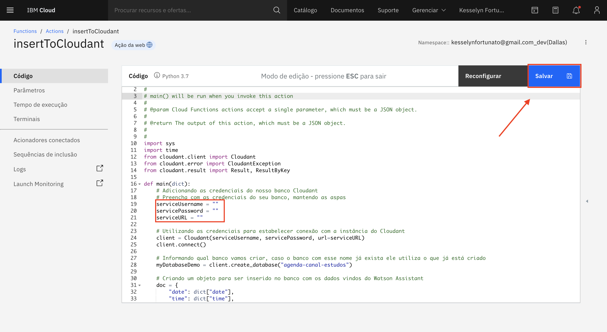

Para mais informações, consulte a documentação:
IBM Cloudant [aqui](https://python-cloudant.readthedocs.io/en/stable/) e [aqui](https://cloud.ibm.com/apidocs/cloudant?code=node)
IBM Cloud Functions [aqui](https://cloud.ibm.com/apidocs/functions?code=node#introduction)

---

## Escrito por:


### [Kesselyn Fortunato](https://www.linkedin.com/in/kesselynfortunato/)

Watson Specialist