# **Integrando ChatBot com página html**

## **Embasamento teórico**

### **O que é um WebHook?**

É uma forma para recebe informações quando há um evento e produzir uma ação ou uma resposta como ocorre em uma função os Webhooks também são conhecidos como: impulso api e Retorno de chamada Web

### **Para que serve um WebHook?**

Quando um Evento é disparado eles fazem o que tem que fazer e produzem uma resposta que geralmente é um JSON ou XML e geralmente o criador do Webhook prove uma documentação explicando como ele funciona;

## Obtendo o link da sua Function

Este link será inserido no Watson Assistant para que ele possa enviar e receber dados.

1. Vá na sua função criada, clique em "Endpoints"
2. Marque a opção "Enable as Web Action"
3. Clique no símbolo de cópia próximo a url pública gerada (o link será copiado para a área de transferência e iremos utilizar no próximo passo)

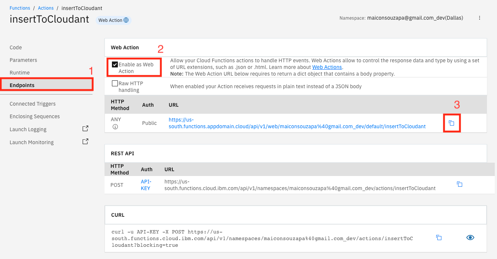

## Habilitando webhooks no Watson Assistant
No Watson Assistant, depois de selecionar a sua skill e clicar nela, vá no menu lateral e selectione Options > Webhooks

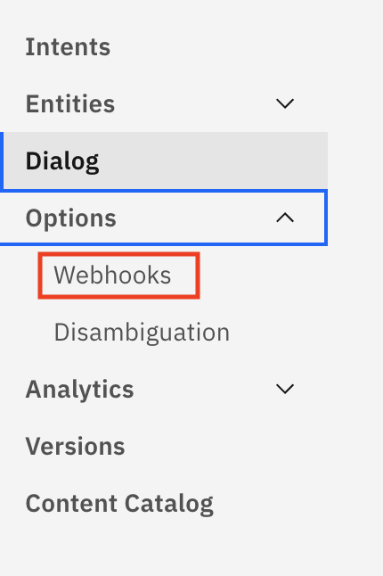

Insira a url da função criada (copiada no passo anterior) e coloque ".json" no final caso não tenha

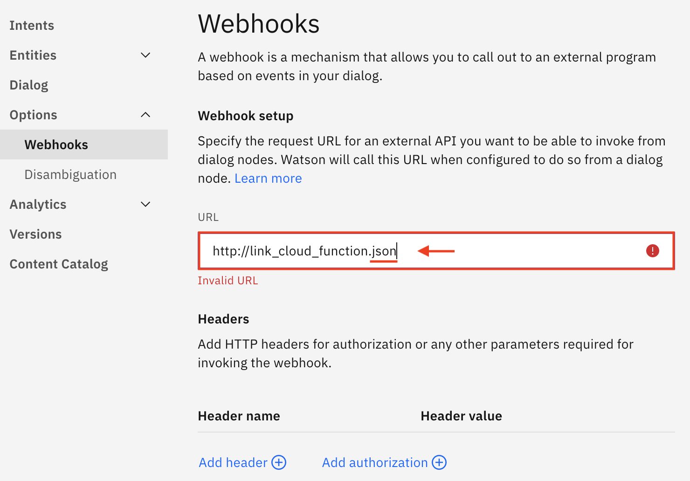

## Utilizando webhooks

Selecione o nó que deseja utilizar o webhook e clique em "customize"

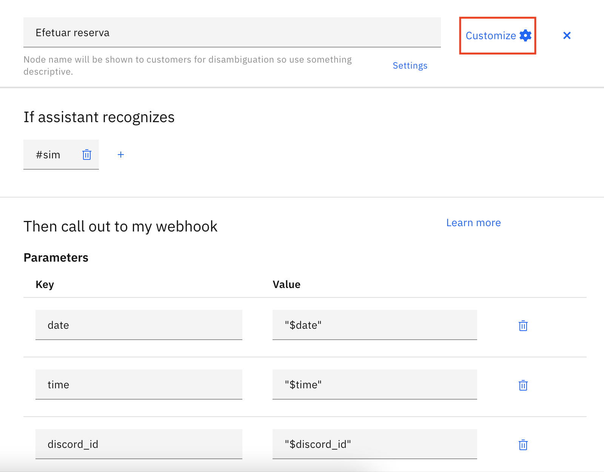

Depois habilite "Callout to webhooks"

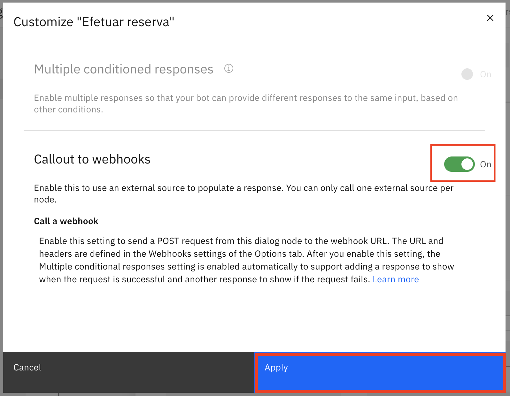

Após isso, um novo espaço será exibido no seu nó: Return variable com o valor "webhook_result_1", esse é o nome da variável com o conteúdo recebido da sua função, você pode alterar para o nome que desejar, mas vamos manter o padrão por aqui.

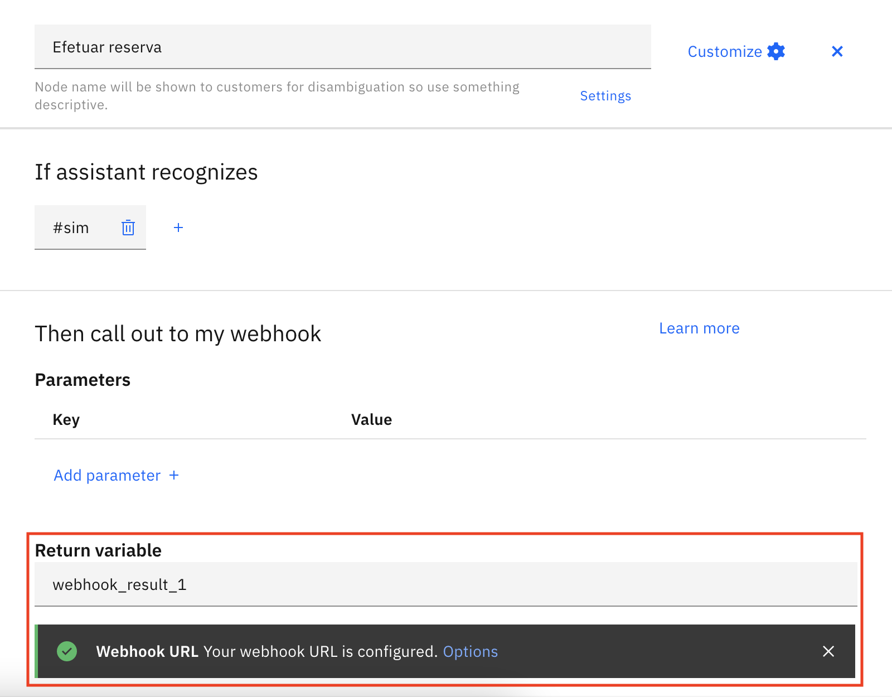

Será criado mais um espaço chamado "Assistant responds", é aqui que definimos o que deve acontecer em:

1. Quando o assistente reconhecer que a operação foi bem sucedida (geralmente utiliza-se essa validação mas você pode alterar conforme a sua necessidade)
2. Quando qualquer coisa diferente do esperado acontecer, como um erro por exemplo

E em "respond with" de cada linha, colocamos o que deve ser devolvido ao usuário caso entre na condição relacionada.

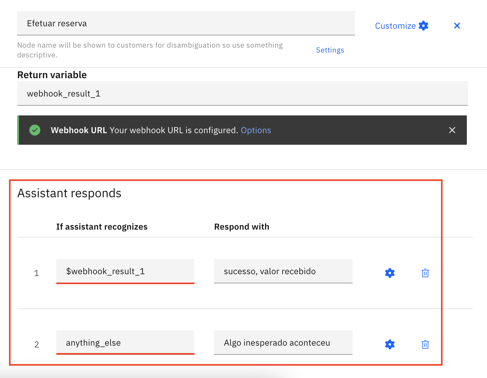

## Obtendo o link da sua Function

Este link será inserido no Watson Assistant para que ele possa enviar e receber dados.

Vá na sua função criada, clique em "Endpoints" e depois no símbolo de cópia próximo a url (o link será copiado para a área de transferência)

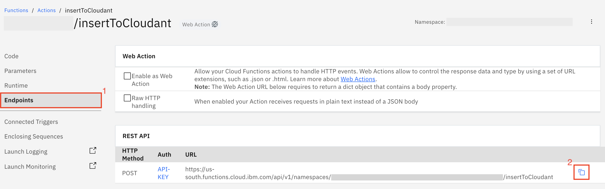

## Habilitando webhooks no Watson Assistant

Depois de habilitado, vá no menu lateral e selectione Options > Webhooks

Insira a url da função criada (copiada no passo anterior) e coloque ".json" no final caso não tenha

## Utilizando webhooks

Selecione o nó que deseja utilizar o webhook e clique em "customize"

Depois habilite "Callout to webhooks"

Após isso, um novo espaço será exibido no seu nó: Return variable com o valor "webhook_result_1", esse é o nome da variável com o conteúdo recebido da sua função, você pode alterar para o nome que desejar, mas vamos manter o padrão por aqui.

Será criado mais um espaço chamado "Assistant responds", é aqui que definimos o que deve acontecer em:

1. Quando o assistente reconhecer que a operação foi bem sucedida (geralmente utiliza-se essa validação mas você pode alterar conforme a sua necessidade)
2. Quando qualquer coisa diferente do esperado acontecer, como um erro por exemplo

E em "respond with" de cada linha, colocamos o que deve ser devolvido ao usuário caso entre na condição relacionada.

## **Gerar link preview**

O "link preview" é utilizado para realizar a integração entre o *Watson Assistent* a página html. Para gerar o link preview, basta seguir os passos abaixo:

1. Na página inicial, clique em "Lista de Recursos", localizada no lado superior esquerdo

2. Na lista de recursos, localize a pasta de *"Serviços"* e selecione *"Watson Assistent -zs"*

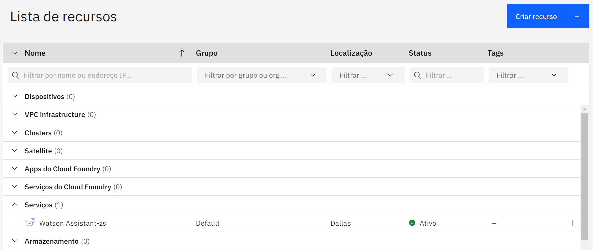

3. Localize a caixa de *"Start by launching the tool"* e clique no botão azul, chamado ***Launch Watson Assistant***

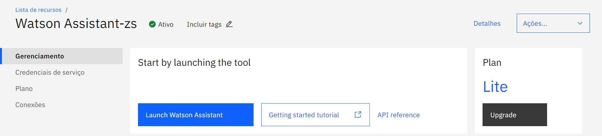

4. Após isso, selecione a opção "Assistents" no lado superior esquerdo e selecione o assistente criado em nosso último encontro

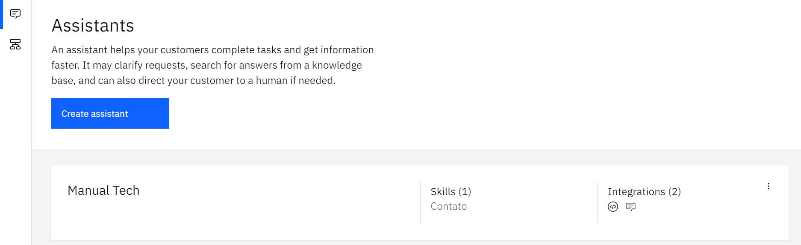

5. Feito isso, clique em "Preview"

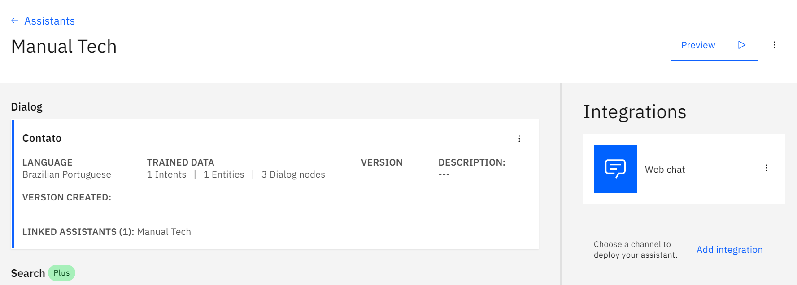

6. Selecione a opção "View web chat"

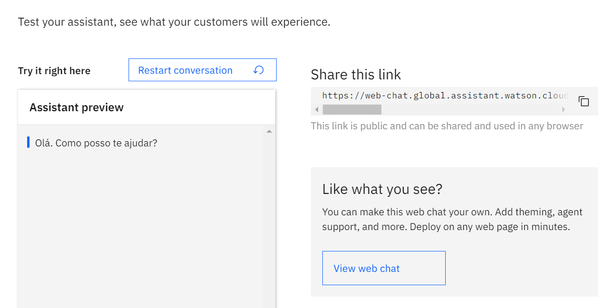

7. Na aba "Style", customize seu chat bot como desejar, no exemplo abaixo, iremos alterar o nome do nosso chatbot para "Tech Week", alterar a cor do cabeçalho para #FFC42E e a cor da interação para #FFC42E

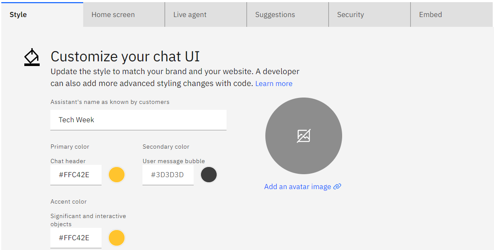

8. Após isso, vá para a aba "Home Screen" e desabilite a opção e "Make a good first impression and get customers the help they need more quickly"

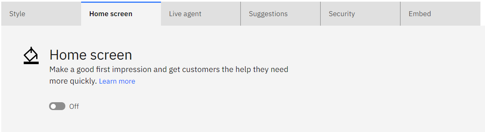

9. Feito isso, clique em "Embed" e copie o código javascript

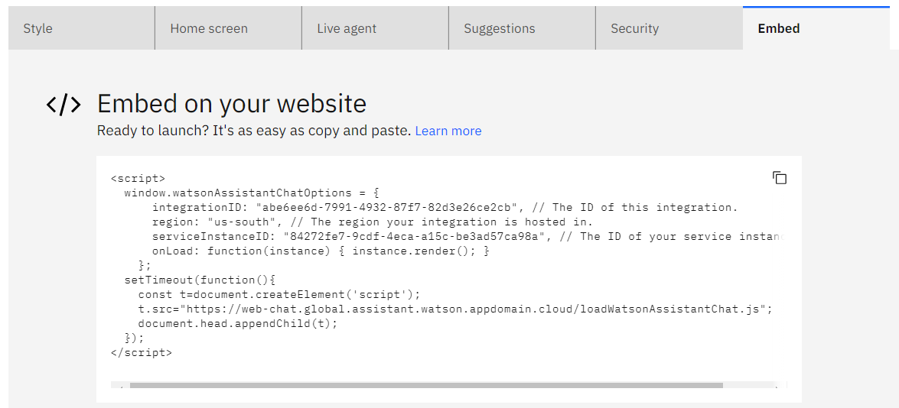

---

## **Integrando ChatBot com página html**

Para realizar a integração do ChatBot com a página html, basta colar o código javascript da etapa anterior no seu código html. Abaixo mostraremos um passo a passo de como fazer isso

1. Clone o repositório do link: https://github.com/codando-community/manual-tech-2021-priv/tree/main/deploy-do-seu-chatbot/html-deploy-do-seu-chatbot

2. No Visual Studio Code, abra o projeto que acabou de ser clonado e navegue até o arquivo main.html

3. Cole o Embed copiado no passo 9 da seção *"Gerar link preview"* entre as tags </body> e </html>

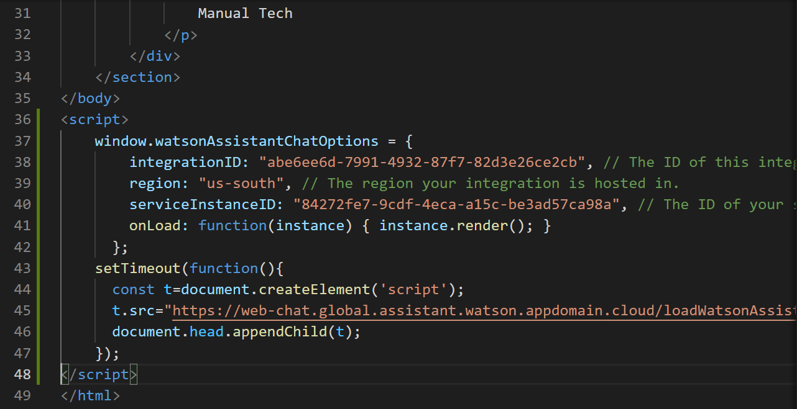

4. instale a extensão **"Live Server"**

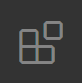

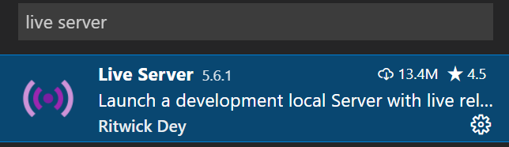

5. Abra novamente o arquivo main.html, clique com o botão direito e selecione a opção *Open with Live Server*

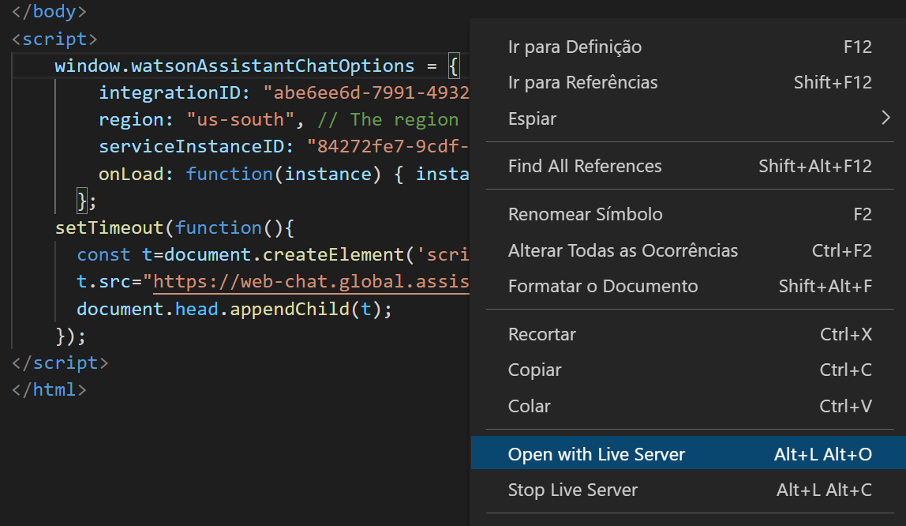

6. Abra o navegador e veja o seu html com a integração do ChatBot

---

Parabéns, você acabou de realizar a integração do seu Chatbot com a página html
